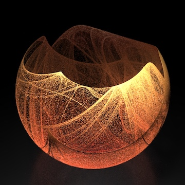
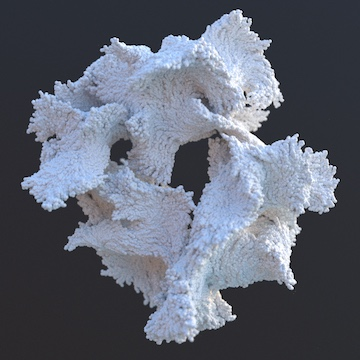
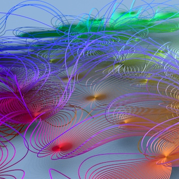

# thi.ng/houdini

Houdini HDAs &amp; sketches (VEX, OpenCL, Python)

Not much here yet...

## /hda - digital assets

### PTF (Parallel Transport Frames)

<small>Tags: VEX, curves, polygons</small>

Sweeps profile shape along one or multiple curves. Use multiple instances for recursive application. Parameters for twisting, radius modulation ramp, multiple generation modes: curves, tube, disc. Includes Help page w/ further details.

### Phyllotaxis

<small>Tags: Python, points</small>

Point generator for phyllotaxis patterns

### SVG polygon import

<small>Tags: Python, polygons</small>

Imports first `<polygon>` element from given SVG file. No SVG transforms are supported. No 3rd party deps required.

### Tessellations

<small>Tags: Python, polygons</small>

Recursive face tessellations: tri fan, quad fan, edge split triangles. An optional displacement amount can be specified for the latter two modes.

## /hip - scenes

### DeJong

<small>Tags: OpenCL, simulation, points</small>

Uses an OpenCL kernel to compute the 2D DeJong strange attractor w/ 3 million particles, then applies a second kernel to perform stereographic transformation to 3D.

### DLA

<small>Tags: VEX, simulation, points</small>

VEX simulation of Diffusion-limited aggregation (DLA), supports various params to control growth. Sim uses an initial set of seed particles, then each frame spawns a fixed number of new particles in the vicinity of existing points. Each particle has a selection probability attrib, which decays each time the particle is used as growth source. Once that probability is less than configured threshold the particle is ignored as source for new growth.

This implementation is based on the approach taken in [toxiclibs](http://toxiclibs.org/2010/02/new-package-simutils/). For an alternative approach, see [Entagma](http://www.entagma.com/vex-in-houdini-diffusion-limited-aggregation-plus-rendering-in-mantra-redshift/).

### Dipole fieldlines

<small>Tags: VEX, simulation, curves</small>

VEX field line simulation between randomly charged dipoles. Takes an input geometry, and spawns a configurable number of agents in a disc around each point. These agents are then attracted/repelled by other poles in the field. Each agent's trajectory is stored in individual polylines. Agents are removed from the sim (not updated further) once they've reached another pole.

## License

&copy; 2017 Karsten Schmidt // ASL2 licensed
